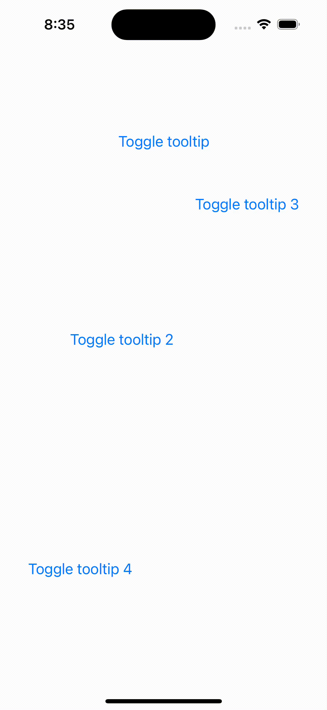

# react-native-reanimated-tooltip

Tooltip for React Native using React Native Reanimated and Modal



## Installation

```sh
npm install react-native-reanimated @gorhom/portal react-native-reanimated-tooltip
```

## Usage

```ts
import { PortalProvider } from '@gorhom/portal';
import React from 'react';
import { Text, Button } from 'react-native';
import { Tooltip } from 'react-native-reanimated-tooltip';
import { FadeOut, FadeIn } from 'react-native-reanimated';

const [visible, setVisible] = React.useState(false);
<PortalProvider>
  <Tooltip
    content={
      <Text>Tooltip</Text>
    }
    visible={visible}
    onPress={() => {
      setVisible(false);
    }}
    entering={FadeIn}
    exiting={FadeOut}
  >
    <Button
      title="Toggle tooltip"
      onPress={() => {
        setVisible(true);
      }}
    />
  </Tooltip>
</PortalProvider>

```

## Configuration

Check [TooltipProps](https://github.com/johankasperi/react-native-reanimated-tooltip/blob/efd333ae9dea7d1705a8828f2a82ba65338956f2/src/Tooltip.tsx#L29)

## Contributing

See the [contributing guide](CONTRIBUTING.md) to learn how to contribute to the repository and the development workflow.

## License

MIT

---

Made with [create-react-native-library](https://github.com/callstack/react-native-builder-bob)
